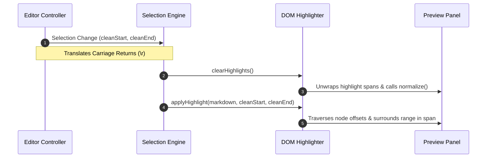
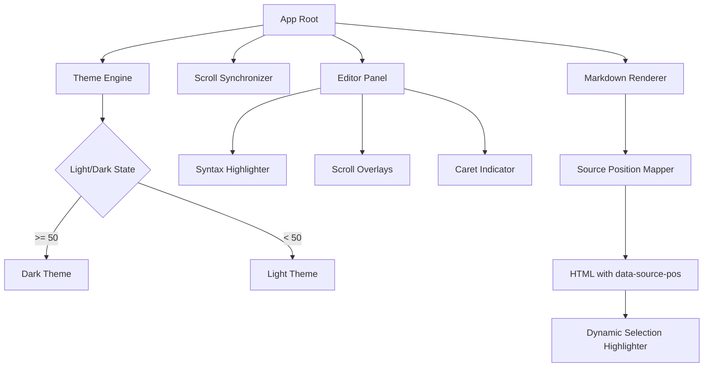

# ☄️ Markdown Stress Test Arena

This document contains highly complex nested markdown structures to stress test rendering correctness, custom scrollbar synchronization, logo styling engine, Mermaid rendering, and the visual selection highlights.

---

## 🏗️ Deeply Nested Grid Layouts & Formatting

> [!NOTE]
> This section combines nested blockquotes, multi-level lists, task items, text styling combinations, and escapes.

> Outer Blockquote level 1
> > Inner Blockquote level 2
> > * **Unordered List Level 1** containing a link: [Google](https://google.com)
> >   * _Italicized level 2_ with some `inline code`
> >     1. **`Bold Codespan`** within an ordered item
> >     2. Checkbox stress test:
> >        - [x] Completed task item with **bold** *italic* ~~strike-through~~ text
> >        - [ ] Uncompleted task item containing escaped characters: `\*not italic\*` and `\\` slash
> >        - [ ] Nested codespan: `` `word1 `word2` word3` ``

---

## 📊 Matrix & Tables with Inline Nesting

This table tests nested block rendering within cells. Each cell contains multiple formatting styles.

| Character Range | Nested Element Types | Expected Preview Result | Status |
| :--- | :---: | :--- | :---: |
| `0-25` | **Bold**, _Italics_, ~~Strike~~ | Full **combined** _formatting_ in cell | [x] OK |
| `26-100` | Inline `code` + [Link](https://google.com) | Clean wrapping inside cell boundary | [ ] Pending |
| `101-200` | Escaped delimiters `\|` and `\` | Delimiter character `|` rendered cleanly | [x] OK |
| `201+` | Image + Alt logo replacement |  | [x] Active |

---

## 🧜‍♀️ Mermaid Rendering Stress Test

This tests the async loading, scaling, theme mapping, and selection highlighting behavior of the Mermaid engine.

### Sequence Flow Chart



### Complex Tree Diagram



---

## 💻 Codespans, Multi-Line Code, and Escape sequences

This section evaluates the raw code block parsers and selections over escape symbols.

### Double-Backtick Codespans
- Double backtick wrapper: `` `word1` `` inside `` `word2` ``.
- Complex escape characters: `\` \` \` \` \` \` \`
- Raw HTML blocks inside markdown:
  ```html
  <div class="test-class" style="color: var(--text-primary); background: var(--bg-code);">
    <p>HTML element rendered inside markdown blocks.</p>
  </div>
  ```

### Advanced Syntax Highlight Block
```javascript
// Test JS Highlight Syntax inside the code parser
const stressTestSelection = (start, end) => {
  const elements = document.querySelectorAll('[data-source-pos]');
  elements.forEach(el => {
    const pos = el.getAttribute('data-source-pos');
    if (pos) {
      const [s, e] = pos.split('-').map(Number);
      console.log(`Intersecting offset check: ${s} to ${e} against ${start}-${end}`);
    }
  });
};
```

---

## 🏁 End of Stress Test
Final paragraph with miscellaneous characters: ~!@#$%^&*()_+{}|:"<>?-=[]\;',./.
Check selection mapping over this line.
